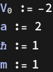

# Relativistic Quantum Mechanics

By: Salazar Angel and Potosi Quray

## TISE: The Square Well Potential

#### 1. Solving the Schrodinger Equation



```wl
In[]:= f[x_] := Piecewise[{{0, x < -a}, {Subscript[V, 0], -a <= x <= a}}];
 Plot[f[x], {x, -4, 4}, PlotStyle -> Thick, AxesLabel -> {"x", "V(x)"},Filling -> Axis] 
  
 
```


```wl
In[]:= 
```

##### Regions to the left and right of the barrier potential

The time-independent Schrodinger Equation has different forms in the regions to the left and right of the barrier potential:

##### First region x<0:


Let k1 =   


##### Second Region 0<x>a


 Let k2 =   


##### Third Region x>a


#### 2. Getting the system of equations of Boundary Conditions

We apply the matching conditions for ψ(x) and ψ'(x), that is at the points x=-a and x=a, four equations in the arbitrary constants A, B, C, D, and F will be obtained: 


```wl
Out[]= A E^(-2 k1) == C E^(-2 I k2) + D E^(2 I k2)
```


```wl
Out[]= D E^(-2 I k2) + C E^(2 I k2) == E^(-2 k1) G
```


```wl
Out[]= A E^(-2 k1)k1 == I C E^(-2 I k2)k2 - I D E^(2 I k2) k2
```


```wl
Out[]= -I D E^(-2 I k2)k2 + I C E^(2 I k2)k2 == -E^(-2 k1) G k1
```

#### 3. Obtaining the Transcendental Equation

We add and subtract equations from the system of equations

```wl
In[]:= eq5 = A Exp[-2 k1] + Exp[-2 k1] G == C Exp[-2 I k2] + D Exp[2 I k2] + D Exp[-2 I k2] + C Exp[2 I k2] // FullSimplify
```

```wl
Out[]= E^(-2 k1) (A + G) == 2 (C + D) Cos[2 k2]
```

```wl
In[]:= eq6 = A E^(-2 k1) k1 + E^(-2 k1)G k1 ==  I C E^(-2 I k2)k2 - I D E^(2 I k2)k2 - (-I D E^(-2 I k2)k2 + I C E^(2 I k2)k2) // FullSimplify
```

```wl
Out[]= E^(-2 k1) (A + G) k1 == 2 (C + D) k2 Sin[2 k2]
```


```wl
Out[]= k1 == k2 Tan[2 k2]
```

#### 4. Finding the roots of the transcendental Equation


```wl
In[]:= sol = FindRoot[TrasEq[En], {En, -0.02}]
```

```wl
Out[]= {En -> -0.0405069}
```

Now we implement a iterative method to find the roots for a range of values of V0


```wl
In[]:= 
  (*we find one root at a given V0 *) 
   Clear[EvenEnergyBrent]; 
    EvenEnergyBrent[V0_?NumericQ] := Module[{pad, emin, emax, grid, vals, seg}, If[V0 >= 0, Return[Missing["NoBoundStates"]]]; 
       pad = Max[1.*^-4, 5.*^-3 Abs[V0]]; 
       {emin, emax} = {V0 + pad, -pad}; 
       grid = Subdivide[emin, emax, 600]; 
       vals = Quiet[feven[#, V0]] & /@ grid; 
       seg = SelectFirst[Partition[Transpose[{grid, vals}], 2, 1], (NumericQ[Times @@ Sign[#[[All, 2]]]] && Times @@ Sign[#[[All, 2]]] < 0) &, Missing["NoBracket"]]; 
       If[seg === Missing["NoBracket"], Return[Missing["NoRoot"]]]; 
       En /. FindRoot[feven[En, V0] == 0, {En, seg[[1, 1]], seg[[2, 1]]}, Method -> "Brent", MaxIterations -> 300]]; 
    
   (*Track the lowest even level across a list of V0s,reusing the previous solution as a seed*) 
    Clear[TrackEvenBranch]; 
    TrackEvenBranch[V0min_ : -2., V0max_ : -0.05, dV_ : 0.05] := Module[{vlist, pad, lastE = Missing["None"], out = {}}, vlist = Range[V0min, V0max, dV]; 
       Do[pad = Max[1.*^-4, 5.*^-3 Abs[v]]; 
        If[lastE === Missing["None"], lastE = EvenEnergyBrent[v], With[{emin = v + pad, emax = -pad, e0 = lastE}, lastE = Quiet@Check[En /. FindRoot[feven[En, v] == 0, {En, Clip[e0, {emin, emax}] - 0.1 Abs[dV], emin, emax}, MaxIterations -> 200], Missing["fail"]]; 
          If[lastE === Missing["fail"], lastE = EvenEnergyBrent[v]];]];
        AppendTo[out, {v, lastE}], {v, vlist}]; 
       out];
```

```wl
In[]:= data = TrackEvenBranch[-2.0, -0.05, 0.02];
```

#### 5. Plot Energy E vs Potential V0

```wl
In[]:= dataPos = {-#[[1]], #[[2]]} & /@ data;
 ListLinePlot[DeleteMissing[dataPos, 1, 2], Frame -> True, PlotRange -> All, PlotStyle -> Thick, FrameLabel -> {"V0", "Energy"}]
```


```wl
In[]:= ContourPlot[k1[En] - k2[En, -V0] Tan[k2[En, -V0] a], {En, -1, 0}, {V0, 0, 1.1}]
```


#### 6. Table 

```wl
In[]:= dataPosHeader = dataPos;
 tableWithHeader = Prepend[dataPos, {"V0 ", "E"}] // TableForm	
 
```

| V0  | E |
| - | - |
| 2. | -1.8039514221610908 |
| 1.98 | -1.7843624635480448 |
| 1.96 | -1.7647786032286659 |
| 1.94 | -1.7451999525139539 |
| 1.92 | -1.7256266262387925 |
| 1.9 | -1.7060587429084555 |
| 1.88 | -1.6864964248534753 |
| 1.8599999999999999 | -1.6669397983926757 |
| 1.84 | -1.6473889940048847 |
| 1.82 | -1.6278441465098852 |
| 1.8 | -1.6083053952592024 |
| 1.78 | -1.588772884337373 |
| 1.76 | -1.5692467627743876 |
| 1.74 | -1.5497271847700578 |
| 1.72 | -1.5302143099311114 |
| 1.7 | -1.5107083035218891 |
| 1.68 | -1.491209336729582 |
| 1.66 | -1.471717586945028 |
| 1.6400000000000001 | -1.4522332380601684 |
| 1.62 | -1.432756480783355 |
| 1.6 | -1.4132875129738072 |
| 1.58 | -1.3938265399966117 |
| 1.56 | -1.3743737750998006 |
| 1.54 | -1.3549294398151575 |
| 1.52 | -1.335493764384556 |
| 1.5 | -1.3160669882137999 |
| 1.48 | -1.2966493603561042 |
| 1.46 | -1.2772411400275565 |
| 1.44 | -1.2578425971571185 |
| 1.42 | -1.2384540129739645 |
| 1.4 | -1.2190756806352196 |
| 1.38 | -1.199707905897464 |
| 1.3599999999999999 | -1.1803510078356882 |
| 1.3399999999999999 | -1.1610053196137662 |
| 1.3199999999999998 | -1.141671189310903 |
| 1.2999999999999998 | -1.1223489808089924 |
| 1.28 | -1.1030390747463112 |
| 1.26 | -1.0837418695435654 |
| 1.24 | -1.0644577825089345 |
| 1.22 | -1.0451872510294882 |
| 1.2 | -1.0259307338571575 |
| 1.18 | -1.0066887124983686 |
| 1.1600000000000001 | -0.9874616927174678 |
| 1.1400000000000001 | -0.9682502061652503 |
| 1.12 | -0.949054812145232 |
| 1.1 | -0.9298760995318077 |
| 1.08 | -0.9107146888561601 |
| 1.06 | -0.8915712345777757 |
| 1.04 | -0.8724464275615712 |
| 1.02 | -0.8533409977833698 |
| 1. | -0.8342557172892512 |
| 0.98 | -0.8151914034378109 |
| 0.96 | -0.7961489224582533 |
| 0.94 | -0.7771291933617955 |
| 0.9199999999999999 | -0.758133192249145 |
| 0.8999999999999999 | -0.739161957062951 |
| 0.8799999999999999 | -0.7202165928413096 |
| 0.8599999999999999 | -0.7012982775368026 |
| 0.8400000000000001 | -0.6824082684754177 |
| 0.8200000000000001 | -0.6635479095413286 |
| 0.8 | -0.6447186391872741 |
| 0.78 | -0.6259219993865945 |
| 0.76 | -0.6071596456624391 |
| 0.74 | -0.5884333583529203 |
| 0.72 | -0.5697450552989254 |
| 0.7 | -0.5510968061749898 |
| 0.6799999999999999 | -0.5324908487244557 |
| 0.6599999999999999 | -0.5139296072098256 |
| 0.6399999999999999 | -0.49541571344999774 |
| 0.6199999999999999 | -0.47695203089081284 |
| 0.5999999999999999 | -0.45854168224774866 |
| 0.5800000000000001 | -0.4401880813745301 |
| 0.56 | -0.4218949701552287 |
| 0.54 | -0.4036664613985525 |
| 0.52 | -0.385507088942716 |
| 0.5 | -0.3674218664727155 |
| 0.48 | -0.3494163569296207 |
| 0.45999999999999996 | -0.33149675488194674 |
| 0.43999999999999995 | -0.313669984871581 |
| 0.41999999999999993 | -0.2959438195962304 |
| 0.3999999999999999 | -0.27832702292525396 |
| 0.3799999999999999 | -0.2608295242787444 |
| 0.3599999999999999 | -0.2434626329953086 |
| 0.33999999999999986 | -0.22623930421590008 |
| 0.32000000000000006 | -0.20917447188642727 |
| 0.30000000000000004 | -0.19228547029385104 |
| 0.28 | -0.17559257397998532 |
| 0.26 | -0.15911969833229228 |
| 0.24 | -0.14289532193684037 |
| 0.21999999999999997 | -0.12695372077069775 |
| 0.19999999999999996 | -0.11133665022105772 |
| 0.17999999999999994 | -0.09609568576512624 |
| 0.15999999999999992 | -0.0812955592835902 |
| 0.1399999999999999 | -0.0670190488431739 |
| 0.11999999999999988 | -0.05337438411854575 |
| 0.09999999999999987 | -0.040506909864709735 |
| 0.08000000000000007 | -0.02861835392514454 |
| 0.06000000000000005 | -0.018000611091458514 |