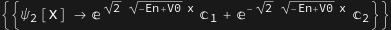

# Relativistic Quantum Mechanics

By: Salazar Angel and Potosi Quray

## TISE:  The Barrier Potential 

#### 1. Solving the Schrodinger Equation


```wl
In[]:= f[x_] := Piecewise[{{0, x < 0}, {Subscript[V, 0], 0 <= x <= 2}}];
 Plot[f[x], {x, -4, 4}, PlotStyle -> Thick, AxesLabel -> {"x", "f(x)"},Filling -> Axis] 
  
 
```


```wl
In[]:= 
```

##### Regions to the left and right of the barrier potential

The time-independent Schrodinger Equation has different forms in the regions to the left and right of the barrier potential:

##### First region x<0:


Let k1 =   


##### Second Region 0<x>a




 Let k2 =   


##### Third Region x>a


#### 2. Getting the system of equations of Boundary Conditions

We apply the matching conditions for ψ(x) and ψ'(x), that is at the points x=0 and x=a, four equations in the arbitrary constants A, B, C, D, and F will be obtained: 


```wl
Out[]= A + B == C + D
```


```wl
Out[]= D E^(-2 I k2) + C E^(2 I k2) == E^(2 I k1) F
```


```wl
Out[]= I A k1 - I B k1 == I C k2 - I D k2
```


```wl
Out[]= -I D E^(-2 I k2)k2 + I C E^(2 I k2)k2 == I E^(2 I k1)F k1
```

#### 3. Solve this systems of equations in terms of A:

```wl
In[]:= Solve[{eq1, eq2, eq3, eq4}, {B, C, D, F}]
```


Thus we have: 


#### 4. Replacing with the constants found in the piece-wise Schrodinger equation:


with:


#### 5. Computing the Transmission and Reflection coefficient

##### The Reflection coefficient  R of the barrier is: 


Turning R expression into a function in order to plot where we are going to change the Energy (En) and Potential (V0).


##### Transmission coefficient T of the barrier is: 


Turning T expression into a function in order to plot where we are going to change the Energy (En) and Potential (V0).

#### 6. Plot of T and R with V0=2 and a=2


```wl
In[]:= V0 = 2;
 Plot[{Tf[En, 2], Rf[En, 2]}, {En, 0, 10}, PlotStyle -> {Red, Blue}, AxesLabel -> {"Energy", "T and R"}]
```


Now we fix the energy to E=1.1 and we vary values over the potential $V_0:$

#### 7. Plot of T and R with Energy = 1.1

```wl
In[]:= En = 1.1;
 Plot[{Tf[En, V], Rf[En, V]}, {V, 0, 10}, PlotStyle -> {Red, Blue}, AxesLabel -> {"\!\(\*SubscriptBox[\(V\), \(0\)]\)", "T and R"}]
```

